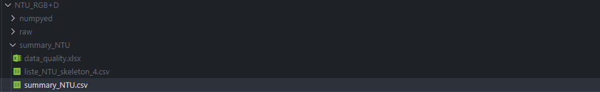

# Dataset 

## NTU_RGB ( from Rose Lab )

"NTU RGB+D" contains 60 action classes and 56,880 video samples.
"NTU RGB+D 120" extends "NTU RGB+D" by adding another 60 classes and another 57,600 video samples, i.e., "NTU RGB+D 120" has 120 classes and 114,480 samples in total.
These two datasets both contain RGB videos, depth map sequences, 3D skeletal data, and infrared (IR) videos for each sample. Each dataset is captured by three Kinect V2 cameras concurrently.
The resolutions of RGB videos are 1920x1080, depth maps and IR videos are all in 512x424, and 3D skeletal data contains the 3D coordinates of 25 body joints at each frame.

## Démarrer
Suivez le tutoriel dans le ReadMe du repo . Lancer build_csv.py pour avoir une version fonctionnelle. 

##  Organisation des fichiers 
Le dossier NTU_RGB+D possède trois dossier:
- raw contient tous les .skeleton du dataset
- numpyed contient tous les .npy des skeleton du dataset
- summary contient 2 .csv :un summary_csv qui contient pour chaque squelette toutes les informations importantes et un autre .csv qui contient  les données pour un squelette .   Le contenu des dataframe sont contenus  dans les fonctions qui les produisent (dans utils/utils_dataset_NTU)

 

    
    contenu du dossier dataset.md
  </a>

<h3 align="center"></h3>

## Comment rajouter mon propre dataset?

Voir cette partie dans le readme de data_provider.

